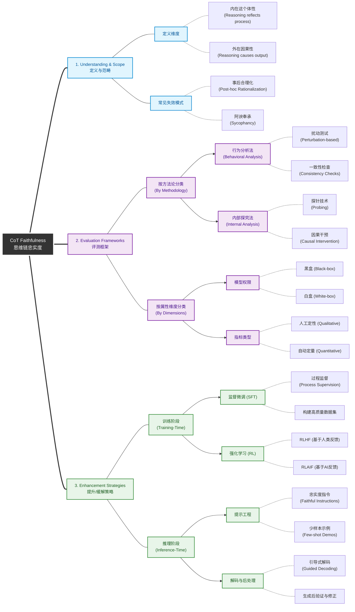

```mermaid
graph LR
    %% --- 定义根节点 ---
    Root["CoT Faithfulness<br>思维链忠实度"]

    %% --- 第一大支柱：理解与范围 (Understanding) ---
    Root === Branch1["1. Understanding & Scope<br>定义与范畴"]
    Branch1 --- Def["定义维度"]
    Def -.- Intrinsic["内在这个体性<br>(Reasoning reflects process)"]
    Def -.- Extrinsic["外在因果性<br>(Reasoning causes output)"]
    
    Branch1 --- Failure["常见失效模式"]
    Failure -.- PostHoc["事后合理化<br>(Post-hoc Rationalization)"]
    Failure -.- Sycophancy["阿谀奉承<br>(Sycophancy)"]

    %% --- 第二大支柱：评测方法 (Evaluation) ---
    Root === Branch2["2. Evaluation Frameworks<br>评测框架"]
    
    %% 按照方法论分类
    Branch2 --- Method["按方法论分类<br>(By Methodology)"]
    Method --> Behavioral["行为分析法<br>(Behavioral Analysis)"]
    Behavioral -.- Perturb["扰动测试<br>(Perturbation-based)"]
    Behavioral -.- Consist["一致性检查<br>(Consistency Checks)"]
    
    Method --> Internal["内部探究法<br>(Internal Analysis)"]
    Internal -.- Probing["探针技术<br>(Probing)"]
    Internal -.- Intervention["因果干预<br>(Causal Intervention)"]
    
    %% 按照访问权限和指标类型分类
    Branch2 --- Dimension["按属性维度分类<br>(By Dimensions)"]
    Dimension --> Access["模型权限"]
    Access -.- BlackBox["黑盒 (Black-box)"]
    Access -.- WhiteBox["白盒 (White-box)"]
    Dimension --> Metric["指标类型"]
    Metric -.- Human["人工定性 (Qualitative)"]
    Metric -.- Auto["自动定量 (Quantitative)"]

    %% --- 第三大支柱：提升策略 (Enhancement) ---
    Root === Branch3["3. Enhancement Strategies<br>提升/缓解策略"]
    
    %% 按照训练阶段分类
    Branch3 --- Training["训练阶段<br>(Training-Time)"]
    Training --> SFT_Branch["监督微调 (SFT)"]
    SFT_Branch -.- Process["过程监督<br>(Process Supervision)"]
    SFT_Branch -.- Golden["构建高质量数据集"]
    
    Training --> RL_Branch["强化学习 (RL)"]
    RL_Branch -.- RLHF["RLHF (基于人类反馈)"]
    RL_Branch -.- RLAIF["RLAIF (基于AI反馈)"]

    %% 按照推理阶段分类
    Branch3 --- Inference["推理阶段<br>(Inference-Time)"]
    Inference --> Prompting["提示工程"]
    Prompting -.- Instruct["忠实度指令<br>(Faithful Instructions)"]
    Prompting -.- FewShot["少样本示例<br>(Few-shot Demos)"]
    
    Inference --> Decoding["解码与后处理"]
    Decoding -.- Guided["引导式解码<br>(Guided Decoding)"]
    Decoding -.- Verify["生成后验证与修正"]

    %% --- 样式美化 ---
    classDef rootNode fill:#333,stroke:#fff,stroke-width:4px,color:#fff,font-size:18px;
    classDef branch1 fill:#e1f5fe,stroke:#0288d1,stroke-width:2px,color:#01579b;
    classDef branch2 fill:#f3e5f5,stroke:#7b1fa2,stroke-width:2px,color:#4a148c;
    classDef branch3 fill:#e8f5e9,stroke:#388e3c,stroke-width:2px,color:#1b5e20;
    
    class Root rootNode;
    class Branch1,Def,Failure branch1;
    class Branch2,Method,Dimension,Behavioral,Internal,Access,Metric branch2;
    class Branch3,Training,Inference,SFT_Branch,RL_Branch,Prompting,Decoding branch3;
```